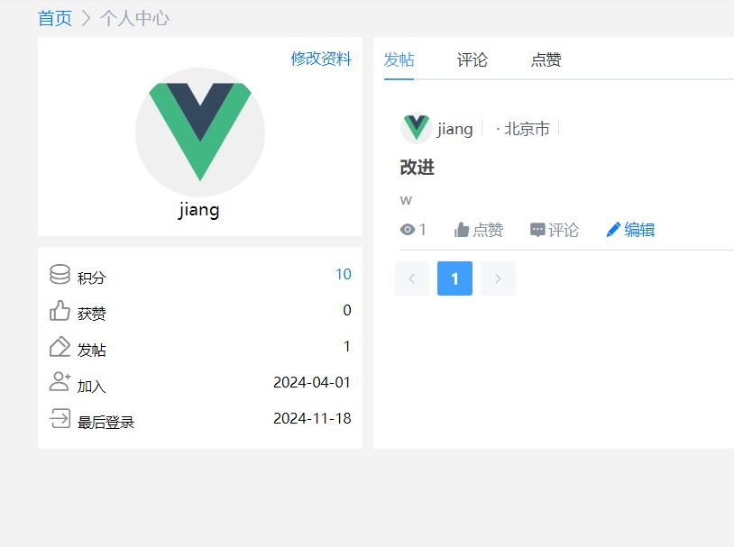

# xiumubss-java
博客论坛项目

## 关于项目

项目概述: 一个仿掘金，贴吧的论坛项目，整个项目分为前台访客系统与后台管理系统。

前台访客系统为用户提供登录，注册，修改信息，浏览文章，发表文章、点赞等功能。

后台管理端为管理人员提供，包括审核文章，修改论坛配置以及修改积分等功能。

项目地址：[朽木论坛](http://106.54.220.141:8010/)

## 项目使用技术

该项目只是一个后端项目，前端不在这里面，非常适合论坛系统的学习和使用，分为管理端与客户端，使用简单的技术栈。

### 后端

- 语言与框架
  - Java 17
  - Springboot2.6+
  - Maven 3.5+
  - rabbitMQ
- 数据库：
  - Mysql 8.0
  - Redis

## 包结构

```
├─xiumubbs-admin                      -管理端
│  └─src
│      ├─main
│      │  ├─java
│      │  │  └─com
│      │  │      └─jiang
│      │  │          ├─aspect          -切面注解
│      │  │          ├─controller      -管理端业务层代码
│      │  │          │  └─base
│      │  │          └─interceptor
│      │  └─resources
│      └─test
│          └─java
├─xiumubbs-common                      -公共模块
│  └─src
│     ├─main
│        ├─java
│        │  └─com
│        │      └─jiang
│        │          ├─annotation        -注解包
│        │          ├─entity            -实体包
│        │          │  ├─config
│        │          │  ├─constants
│        │          │  ├─dto
│        │          │  ├─po
│        │          │  ├─query
│        │          │  └─vo
│        │          ├─Enums            -枚举包
│        │          ├─Exception
│        │          ├─mapper			
│        │          ├─rabbitmq		
│        │          │  └─config
│        │          ├─service		  -功能实现类
│        │          │  └─Impl
│        │          └─Utils				-工具包
│        │              └─schedul
│        └─resources
│            └─com
│                └─jiang
│                    └─mapper
└─xiumubbs-web                        -客户端
    └─src
        ├─main
        │  ├─java
        │  │  └─com
        │  │      └─jiang
        │  │          ├─aspect       -切面注解
        │  │          ├─controller   -业务层代码
        │  │          │  ├─api
        │  │          │  └─base    
        │  │          └─interceptor
        │  └─resources
        └─test
            └─java

```

论坛首页


用户首页


